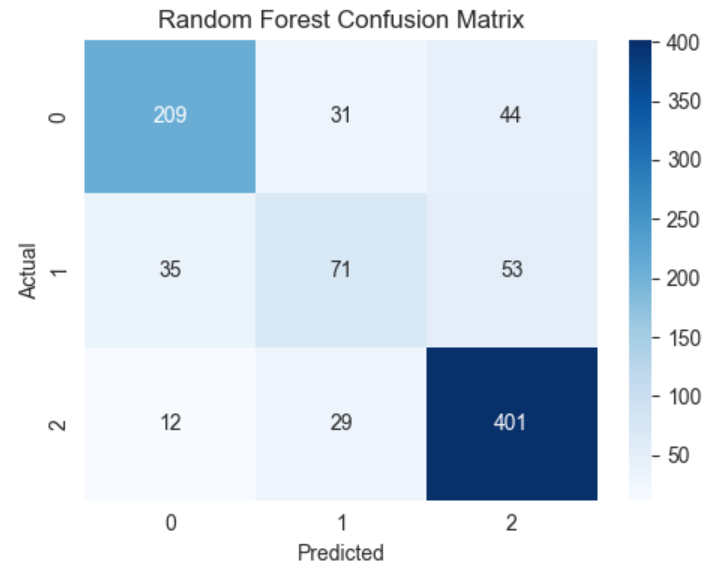

# 🎓 Student Dropout and Academic Success Prediction

## 📊 Model Performance



---

## 📌 Project Overview

Achieved ~77% model accuracy in predicting student outcomes using Random Forest classification. This project predicts whether a student is likely to drop out, remain enrolled, or graduate successfully based on academic performance, demographic, and financial indicators.

---

## 🎯 Business Impact

Early identification of at-risk students enables institutions to provide timely academic and financial interventions, improving student retention and success rates.

---

## 📁 Dataset

The dataset contains academic, demographic, and socioeconomic attributes collected at enrollment and during early semesters.

---

## ⚙️ Approach

- Data cleaning and preprocessing using pipelines  
- Feature engineering and selection to avoid data leakage  
- Model training and comparison  
- Hyperparameter tuning using Random Forest  
- Deployment using Flask REST API  

---

## 🤖 Model Details

- Algorithm: Random Forest Classifier  
- Evaluation Metrics:
  - Accuracy (~77%)  
  - Precision  
  - Recall  
  - Confusion Matrix  

---

## 🔌 API Deployment

- Endpoint: `/predict`  
- Method: POST  
- Input: JSON  
- Output: Predicted student outcome with interpretation  

---

## ⚠️ Limitations

- Some demographic and institutional features are simulated  
- Model performance may vary across institutions  
- Class imbalance may affect dropout prediction accuracy  

---

## 🚀 Future Improvements

- Handle class imbalance using resampling techniques  
- Integrate real-time institutional data  
- Deploy model using cloud platforms  
- Add model monitoring and retraining pipeline  

---

## ▶️ Running the API

```bash
pip install -r requirements
python api.py
